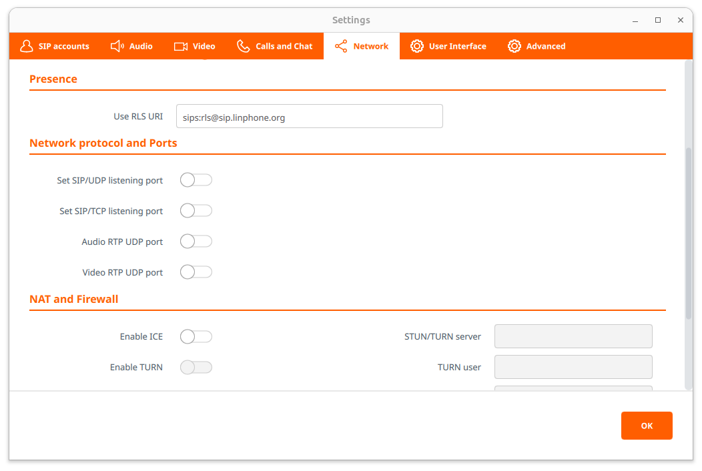
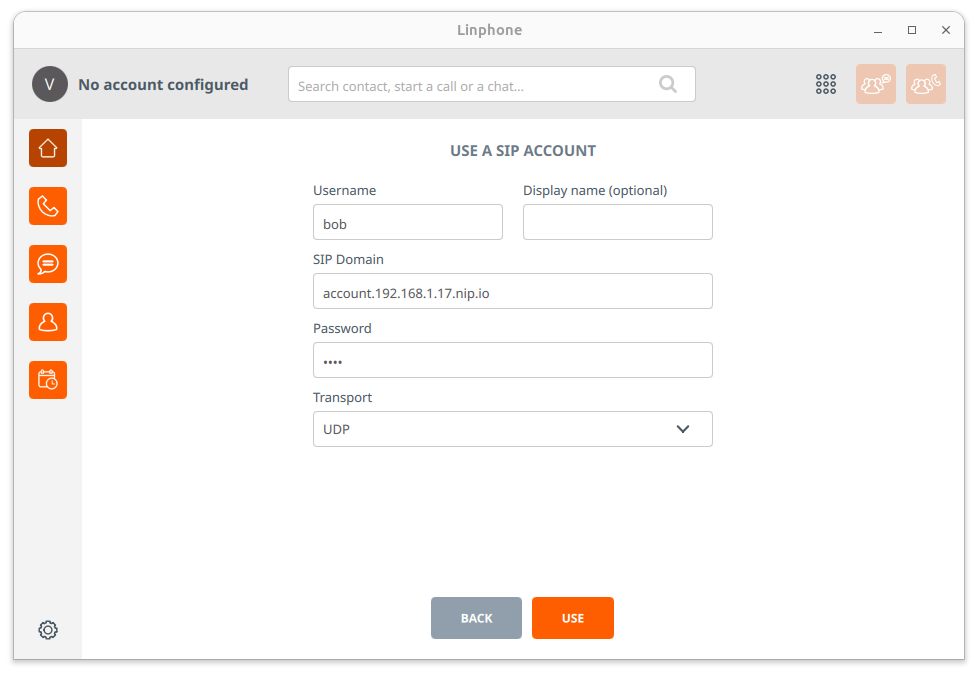
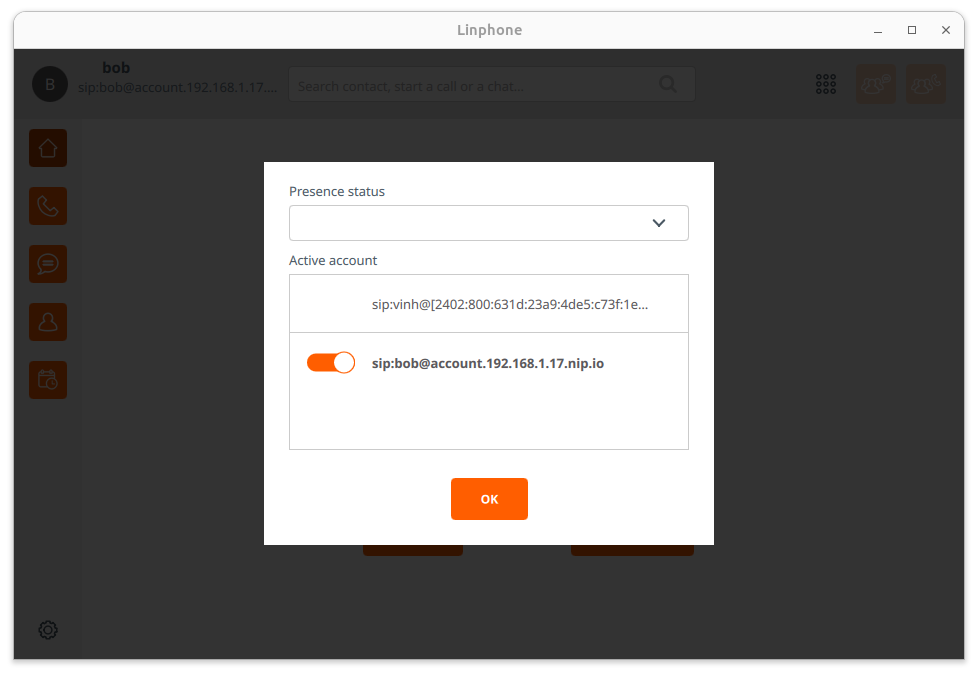
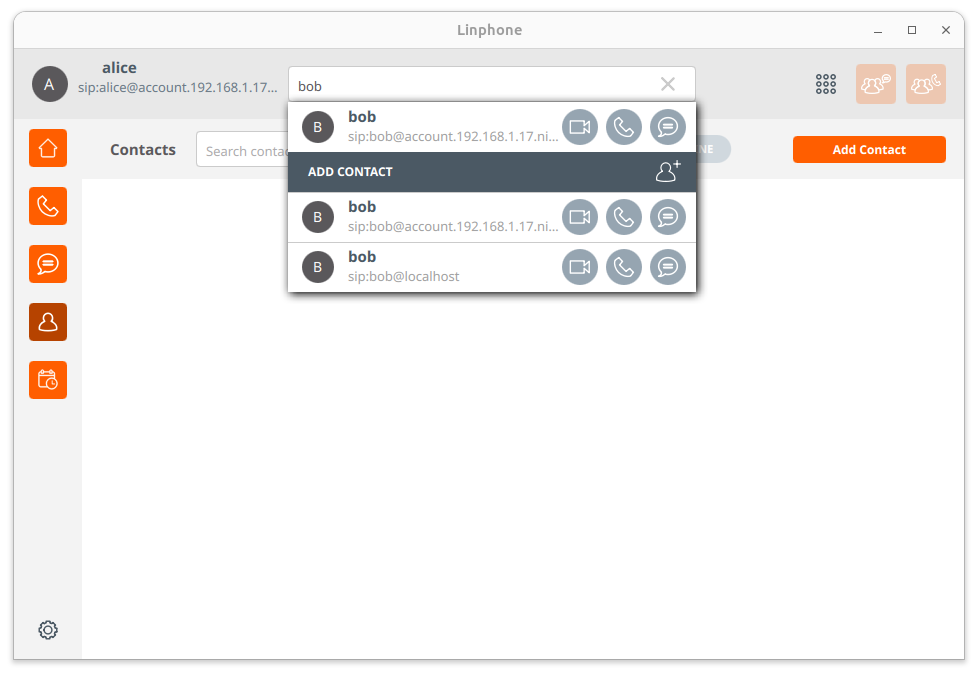
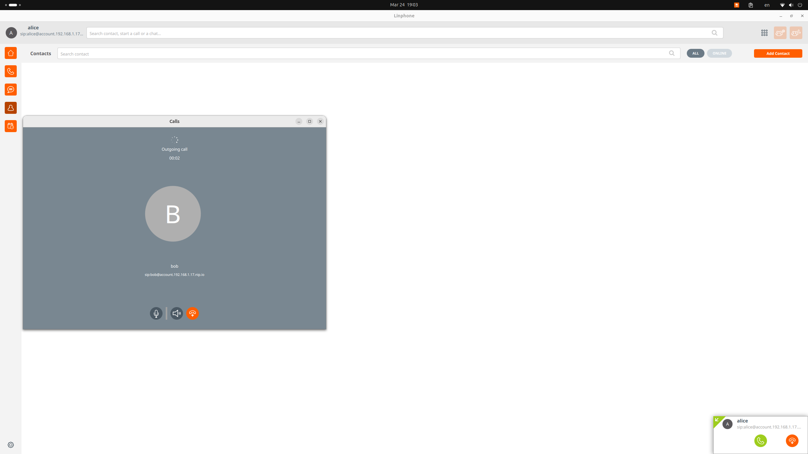
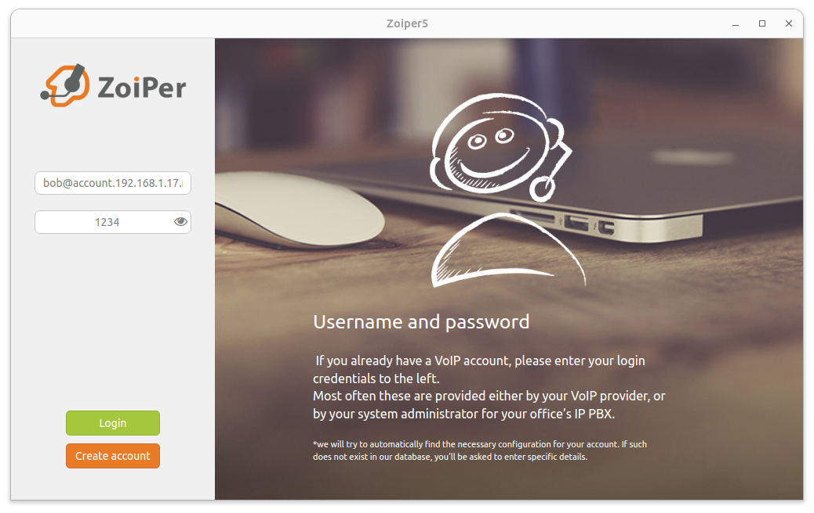
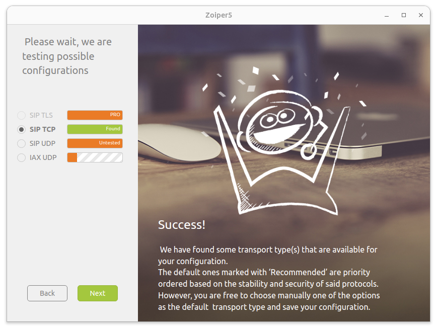
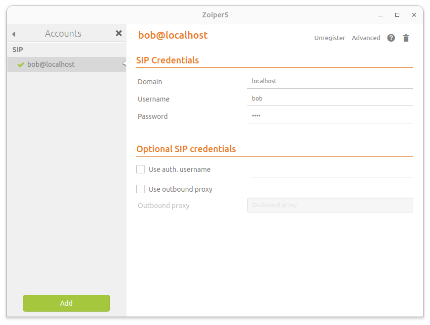

# Setup Softphone

## Setup Linphone for Linux

1. Download and Linphone AppImage from [here](https://new.linphone.org/technical-corner/linphone?qt-technical_corner=2#qt-technical_corner).

2. Make the AppImage executable:

  ```bash
  chmod +x Linphone*.AppImage
  ```

  or, go to the directory where the AppImage is located and right-click on the
  file, select `Properties`, go to the `Permissions` tab, and check the `Allow
  executing file as program` checkbox.

3. Run the AppImage:

  ```bash
  ./Linphone*.AppImage
  ```

  or, double-click on the AppImage file.


  > [!NOTE]
  > If you get an error, you have to install the `libfuse2` package:
  >
  > ```bash
  > # Ref: https://github.com/AppImage/AppImageKit/wiki/FUSE
  > sudo add-apt-repository universe -y
  > sudo apt install libfuse2
  > ```

4. Change the default SIP listener port:

> [!IMPORTANT]
> This step is important because the default SIP port `5060` is used by the
> Flexisip server, and if you don't change it, you won't be able to register the
> SIP client with the Flexisip server.

  - Go to `Settings` (Gear icon) > `Preferences` > `Network` > `Network protocol
    and Ports` > `Set SIP/UDP listening port` and
    change the port to `5062` or different port than the default `5060`, or turn
    it off, so it **won't overlap with the Flexisip server's port**.

  - Do the same for `SIP/TCP listening port`.



5. Click the `Assistant` button to configure the SIP account:

  - Click `USE A SIP ACCOUNT`.

  - Click `I UNDERSTAND` to accept the terms and conditions.

  - Configure the SIP account with the credentials you created in the
    flexisip account management page: `localhost/register`.

    - You can choose either `UDP` or `TCP` for the transport field.

> [!WARNING]
> On MacOS, you have to use `TCP` as the transport protocol, because the `UDP`
> is not working properly. But on Linux, you can use `UDP` without any issues.



6. Check connection status:

  - Click the account name on the top left corner to see the connection status.

  - If the connection is unsuccessful, you will see a red triangle icon.



7. Go the search bar and search for the user you want to call:



8. Result:



## Setup Zoiper for Linux

> [!IMPORTANT]
> Zoiper 5 only support `MD5` authentication, so you have to switch
> `available-algorithms` to `MD5` in the Flexisip server configuration file:
> [`ubuntu23-10/flexisip_conf/flexisip.conf`](../ubuntu23-10/flexisip_conf/flexisip.conf).


1. Go to the [Zoiper download
   page](https://www.zoiper.com/en/voip-softphone/download/current) and download
   the Zoiper deb package.

2. Install the deb package:

  ```bash
  sudo apt install -f ./Zoiper5_5.6.4_x86_64.deb
  ```

> [!NOTE]
> Since ubuntu 23.10 users can't install the deb package directly.

3. Run Zoiper:

  ```bash
  zoiper5
  ```

  or, search for `Zoiper` in the application menu.

4. Click `Continue as a Free user`.

5. Fill in the SIP account details:



> [!TIP]
> If you can't focus on the input fields, you can **drag the window**, so it
> will automatically focus on the input fields. This is a UI bug in the Zoiper
> app.

6. Continue the steps, then we will see the transport settings:



7. Result:


