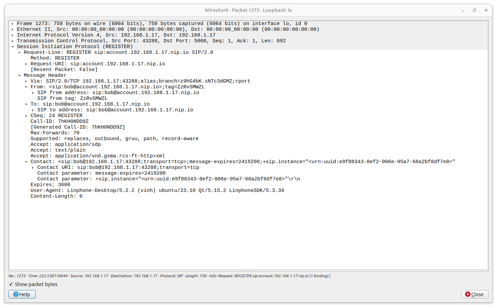
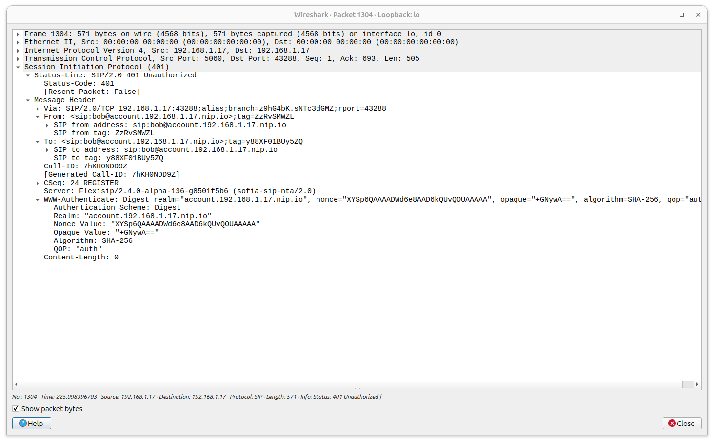
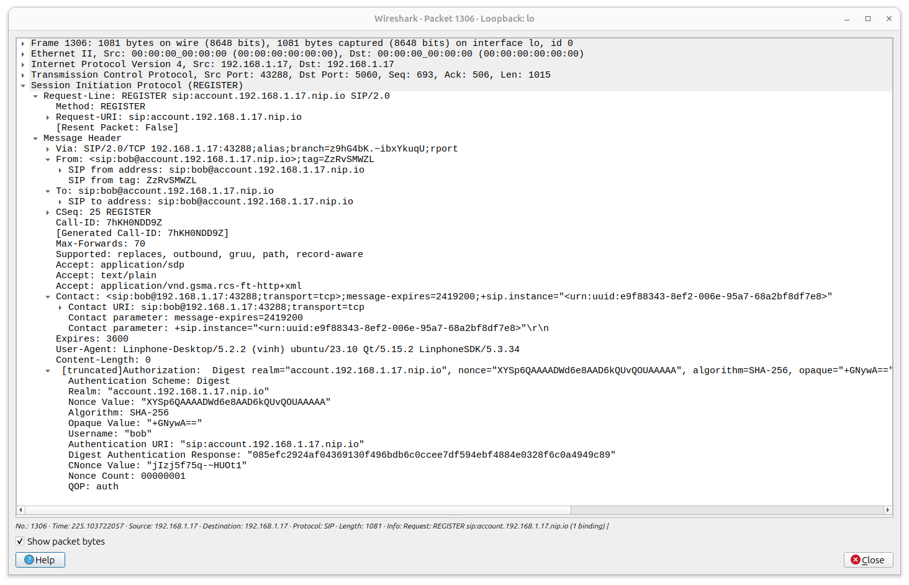
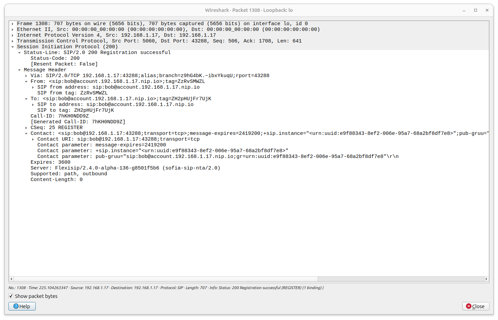
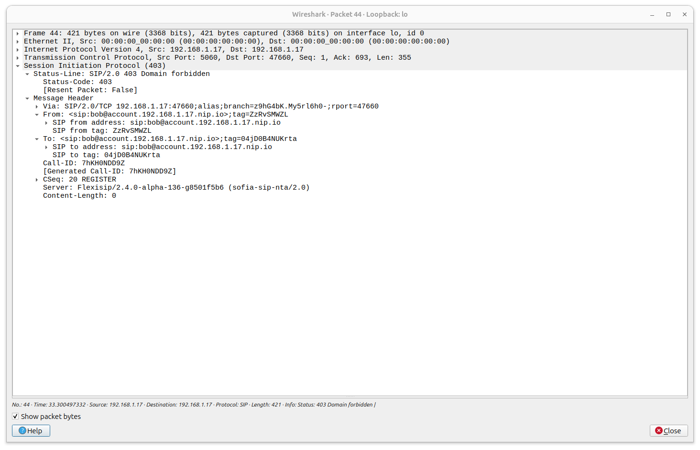

# SIP Authentication Process

## Overview

You can use wireshark to capture the SIP packets and analyze the SIP
authentication process. The following is the SIP authentication process:

1. The SIP client sends a SIP `REGISTER` request to the SIP server:

2. The SIP server sends a `401 Unauthorized` response to the SIP client:

3. The SIP client sends a new `REGISTER` request with the `Authorization`
   header:

The `Digest Authentication Response` is the `SHA-256` hash of the `username`,
`realm`, and `password`. For example, if the `username` is `bob`, the `realm`
is `localhost`, and the `password` is `1234`, the `Digest Authentication
Response` is `SHA-256(bob:localhost:1234)`.

4. The SIP server sends a `200 OK` response to the SIP client:

## Other responses:

- 403 Domain Forbidden: Domain is not configured for `auth-domains` in the
  [`ubuntu23-10/flexisip_conf/flexisip.conf`](../ubuntu23-10/flexisip_conf/flexisip.conf)
  file.

- 401 Unauthorized:
  - Domain is not configured for `reg-domains` in the
    [`ubuntu23-10/flexisip_conf/flexisip.conf`](../ubuntu23-10/flexisip_conf/flexisip.conf)
    file.
  - Hash algorithm is not supported by the softphone.
  - The `Authorization` header is missing in the `REGISTER` request.
  - Wrong password in the `Authorization` header.

